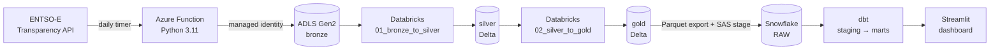

# ⚡ GridPulse EU

**An end-to-end, multi-cloud data pipeline that tracks day-ahead electricity prices and renewable generation for the Netherlands, Belgium and Switzerland.**

`ENTSO-E API → Azure Functions → ADLS Gen2 → Azure Databricks (Delta) → Snowflake → dbt → Streamlit`

🔴 **Live dashboard:** https://gridpulse-eu-tkoy8n3hv7tbk8atn5b8gn.streamlit.app/


---

## The business question

*When is electricity cheapest in NL, BE and CH, and how much does renewable share move the price?*
Energy traders, industrial buyers and anyone scheduling flexible load (EV charging, heat pumps, batch compute) care about this. GridPulse turns raw ENTSO-E XML into a tested star schema and a dashboard that answers it by country, hour and day.

## Architecture



| Layer | What happens | Tech |
|---|---|---|
| **Infra** | Function App, separate data-lake account (bronze / silver / gold / export), App Insights, managed identity, monthly budget alert — all as code | Bicep |
| **Ingest** | Timer-triggered function pulls day-ahead prices and generation per country; fails per country, not all-or-nothing | Azure Functions, `entsoe-py` |
| **Bronze → Silver** | Parses raw XML/zip into typed Delta tables; **8,387 generation rows, 0 nulls, 0 duplicates** | PySpark, Delta Lake |
| **Silver → Gold** | Hourly market table (**1,823 rows**) and daily summary (**29 rows**) with price and renewable share per country | PySpark |
| **Load** | Gold exported as Parquet, loaded into Snowflake via an external stage; row counts reconciled 1:1 with Databricks | Snowflake |
| **Model** | Staging + marts star schema: `dim_country`, `dim_date`, `fct_hourly_market`, `fct_daily_summary` — **17 not_null / unique / relationships tests passing** | dbt Cloud |
| **Serve** | Filterable dashboard (country, date range) reading straight from the marts | Streamlit Community Cloud |

## Repository layout

```
infra/main.bicep            Azure infrastructure as code
ingestion/function_app.py   ENTSO-E → bronze ingestion function
transform/                  Databricks notebooks (bronze→silver, silver→gold)
models/staging/             dbt staging models + sources
models/marts/               dbt star schema + tests (schema.yml)
dasboard/app.py             Streamlit dashboard
```

## Engineering decisions

- **Managed identity, not keys** — the function writes to the lake with `Storage Blob Data Contributor`; no connection strings in code.
- **Separate lake account** from the Function's runtime storage, so pipeline data and platform plumbing never mix.
- **Cost control built in** — budget alert at 80% / 100%, single-node Databricks cluster with 30-min auto-terminate, and the Azure resource group torn down after the build. Snowflake + dbt + Streamlit stay live.
- **Reconciliation over trust** — row counts checked at every hop (Databricks gold ↔ Snowflake raw).

## What went wrong (and what I learned)

Re-running the Databricks notebooks from scratch to capture evidence exposed **3 bugs** that had silently drifted in: missing `pandas` / `pyspark.sql.types` imports and a wrong file-path regex in a notebook copy that had diverged from Git. Fixed and pushed — the lesson: **Git is the source of truth, and "it ran once" is not a test.**

## Known gaps / next steps

- Move the ENTSO-E token from app settings to **Azure Key Vault**.
- Add retry with backoff to ingestion; orchestrate the Databricks → Snowflake hop (Airflow / Databricks Workflows).
- Promote dbt models from the dev schema to a proper production deployment job.

## Related

➡️ [Landing Zone EU](https://github.com/Anjum-Kumawat/landing-zone-eu) — an analyst dashboard built on top of this warehouse.

---
*Built by [Anjum Kumawat](https://www.linkedin.com/in/anjum-kumawat) · Data Engineering M.Sc., Aivancity Paris*
